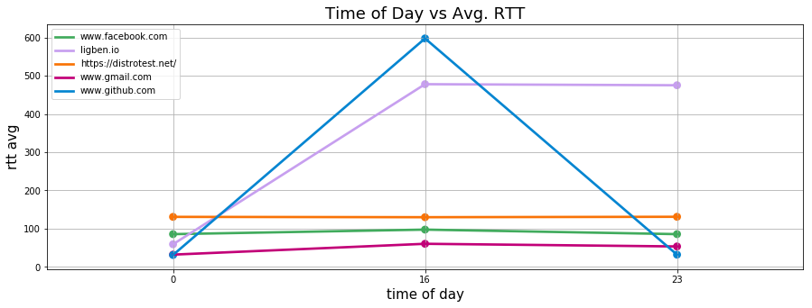
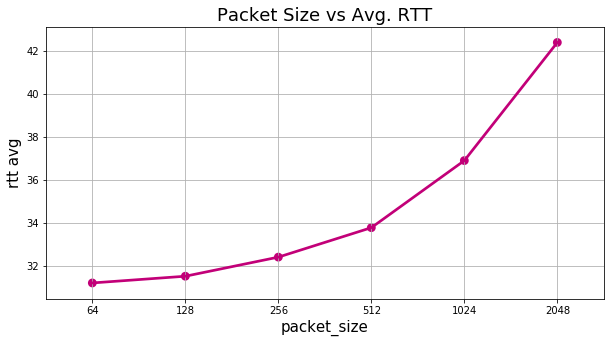

## Q1

### information about 5 hosts selected 
|  | www.facebook.com | ligben.io | https://distrotest.net/ | www.gmail.com | www.github.com |
| --- | --- | --- | --- | --- | --- |
| 0 | edge-star-mini-shv-01-frt3.facebook.com | no-reverse-dns-configured.com | 77-64-170-23.dynamic.primacom.net | fra15s17-in-f5.1e100.net | lb-192-30-253-113-iad.github.com |

### host1 stats

|  | time of day | rtt avg |
| --- | --- | --- |
| 0 | 16 | 97.56775 |
| 1 | 23 | 85.71065 |
| 2 | 0 | 85.69140 |

#### host1 packet loss > 0% stats 
none
### host2 stats

|  | time of day | rtt avg |
| --- | --- | --- |
| 0 | 16 | 478.12775 |
| 1 | 23 | 475.36325 |
| 2 | 0 | 59.20005 |

#### host2 packet loss > 0% stats 

|  | name | IP address | % packet loss | rtt min | rtt avg | rtt max | rtt mdev | time of day | packet_size |
| --- | --- | --- | --- | --- | --- | --- | --- | --- | --- |
| 0 | no-reverse-dns-configured.com | 81.171.22.7 | 60% | 644.095 | 673.385 | 701.591 | 24.476 | 16 | 64 |
| 4 | no-reverse-dns-configured.com | 81.171.22.7 | 40% | 605.473 | 677.117 | 806.046 | 71.284 | 16 | 64 |
| 5 | no-reverse-dns-configured.com | 81.171.22.7 | 30% | 545.013 | 637.961 | 746.901 | 60.038 | 16 | 64 |
| 6 | no-reverse-dns-configured.com | 207.244.67.218 | 10% | 518.437 | 608.082 | 692.761 | 60.912 | 16 | 64 |
| 10 | no-reverse-dns-configured.com | 207.244.67.218 | 10% | 549.187 | 590.188 | 642.977 | 29.260 | 16 | 64 |
| 13 | no-reverse-dns-configured.com | 64.32.8.68 | 60% | 70.726 | 70.760 | 70.797 | 0.025 | 16 | 64 |
| 14 | no-reverse-dns-configured.com | 207.244.67.218 | 30% | 711.798 | 816.819 | 1002.714 | 88.342 | 16 | 64 |
| 16 | no-reverse-dns-configured.com | 64.32.8.68 | 50% | 70.683 | 70.769 | 70.814 | 0.295 | 16 | 64 |

### host3 stats

|  | time of day | rtt avg |
| --- | --- | --- |
| 0 | 16 | 130.02690 |
| 1 | 23 | 131.12605 |
| 2 | 0 | 130.91160 |

#### host3 packet loss > 0% stats 
none

### host4 stats 
|  | time of day | rtt avg |
| --- | --- | --- |
| 0 | 16 | 60.43605 |
| 1 | 23 | 53.49640 |
| 2 | 0 | 32.09665 |

#### host4 packet loss > 0% stats 
none

### host5 stats 

|  | time of day | rtt avg |
| --- | --- | --- |
| 0 | 16 | 597.88420 |
| 1 | 23 | 32.00675 |
| 2 | 0 | 31.17940 |

#### host5 packet loss > 0% stats 

|  | name | IP address | % packet loss | rtt min | rtt avg | rtt max | rtt mdev | time of day | packet_size |
| --- | --- | --- | --- | --- | --- | --- | --- | --- | --- |
| 1 | lb-192-30-253-113-iad.github.com | 192.30.253.113 | 10% | 543.271 | 596.078 | 646.322 | 37.860 | 16 | 64 |
| 5 | lb-192-30-253-113-iad.github.com | 192.30.253.113 | 10% | 515.742 | 563.243 | 611.480 | 29.173 | 16 | 64 |
| 10 | lb-192-30-253-113-iad.github.com | 192.30.253.113 | 10% | 545.990 | 626.497 | 688.748 | 40.341 | 16 | 64 |

**Four Causes of Packet Loss**

1. Link Congestion
Your data must travel through multiple devices and links during its trip across your network. If one of these links is at full capacity when your data arrives, then it must wait its turn before being sent across the wire (this is known as queuing).

2. Device (Router/Switch/Firewall/etc.) Performance
If your bandwidth is adequate, you can still face an issue if your router/switch/firewall is not able to keep up with the traffic.The traffic is reaching the device, but the device's CPU or memory is maxed out and not able to handle extra traffic.

3. Software issues (bugs) on a network device
You must upgrade the software on the affected device(s).

4. Faulty Hardware or Cabling
The faulty hardware must be replaced, or the fault link must be repaired.

### geographical distance affects avg rtt

There is a positive correlation between distance and RTT. There are a number of reasons for this. For example, an increased hop count. The packets have to go through more routers, at each router there may be a delay, therefore more routers, the longer the RTT.
As can be seen from the stats that the server of host2 (libgen.io) is farther than the rest.

### time of day affects avg rtt 

### change in packet size affects avg rtt 

|  | name | IP address | % packet loss | rtt min | rtt avg | rtt max | rtt mdev | time of day | packet_size |
| --- | --- | --- | --- | --- | --- | --- | --- | --- | --- |
| 0 | lb-192-30-253-113-iad.github.com | 192.30.253.113 | 0% | 31.115 | 31.203 | 31.249 | 0.226 | 1 | 64 |
| 1 | lb-192-30-253-113-iad.github.com | 192.30.253.113 | 0% | 30.915 | 31.516 | 31.696 | 0.317 | 1 | 128 |
| 2 | lb-192-30-253-113-iad.github.com | 192.30.253.113 | 0% | 32.287 | 32.405 | 32.591 | 0.231 | 1 | 256 |
| 3 | lb-192-30-253-113-iad.github.com | 192.30.253.113 | 0% | 33.686 | 33.775 | 33.886 | 0.239 | 1 | 512 |
| 4 | lb-192-30-253-113-iad.github.com | 192.30.253.113 | 0% | 36.792 | 36.897 | 37.199 | 0.140 | 1 | 1024 |

|  | packet_size | rtt avg |
| --- | --- | --- |
| 0 | 64 | 31.203 |
| 1 | 128 | 31.516 |
| 2 | 256 | 32.405 |
| 3 | 512 | 33.775 |
| 4 | 1024 | 36.897 |

